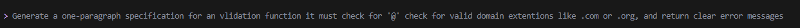
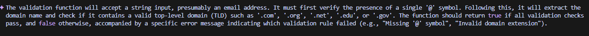

## 1. Nine Pillars Understanding

**Q: Why is using AI agents (Gemini CLI, Claude Code, Cursor Agent) for repetitive tasks better for becoming a system architect?**  
→ Because agents finish boring setup in seconds. My brain stays free to think about big-picture architecture instead of typing boilerplate all day.

**Q: How do the Nine Pillars turn me into an M-Shaped Developer?**  
→ The 9 pillars remove every old excuse (“I can’t be expert in everything”).  
With them I become deep in 3–4 domains at once: Quranic Arabic NLP + Agentic Systems + Production Deployment + Intent Design → that’s the M shape.

## 2. Vibe Coding vs Specification-Driven

**Q: Why does Vibe Coding break after one week?**  
→ Week 1 feels amazing, week 2 I forget my own logic, edge cases crash in production, adding new features becomes pain.

**Q: How does Specification-Driven fix it?**  
→ 30–60 min spec + tests first → AI implements exactly → no surprises, no bugs, 6 months later anyone (even future-me) understands instantly.

## 3. Architecture Thinking in AIDD

**Q: How does architecture-first change my role?**  
→ Old role: write code.  
New role: decide how the whole system lives for 5 years → AI writes the code → I only review architecture.

**Q: Why think in layers & systems, not raw code?**  
→ Raw code is now free (AI does it perfectly).  
Only correct thinking at every layer (intent → spec → architecture → deploy → skills) is valuable. That’s where I spend 100 % of my brain now.

**One-line rule I live by:**  
Spec first, everything else AI handles.

## Part B – Practical Task

### My exact prompt:

### AI-generated 1-paragraph specification (exact output from Gemini):
### My Screenshot (Part B)
