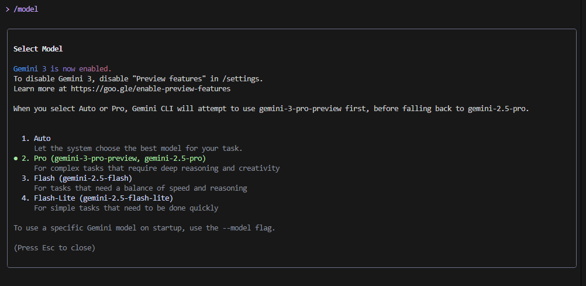

# Gemini 3.0 Research & Practical Guide

## Part A Research Questions (Short Answers)

### 1. What new improvements were introduced in Gemini 3.0?  

- **Deep Think mode**: Enhances reasoning depth for multi-step and complex problems
- **Huge context window**: Supports up to **1 million tokens** as input, allowing it to handle very long documents or dialogs. 
- **Improved safety and factuality**: Better resistance to prompt injection and more accurate, grounded responses.   
- **Advanced multimodal + spatial reasoning**: Processes and reasons about text, images, video, audio, and layout / spatial inputs.  


### 2. How does Gemini 3.0 improve coding & automation workflows? 

- **Agentic development via Google Antigravity**: AI agents can access the code editor, terminal, and browser to plan and run tasks. 
- **Enhanced CLI**: Gemini CLI supports complex workflows, proposes shell commands, and helps automate development tasks.  
- **Vibe coding**: You can describe an app in natural language, and Gemini 3 can generate an interactive, working app in Google AI Studio.  

### 3. How does Gemini 3.0 improve multimodal understanding?  
- Uses a **single unified architecture** to process text, images, video, audio, and code together  
- Delivers **state-of-the-art performance** on multimodal benchmarks: 81% on MMMU‑Pro (image reasoning) and 87.6% on Video‑MMMU (video understanding).
- Offers **configurable media‑resolution** via API, letting developers balance visual fidelity and cost.
- Enhances **document and spatial reasoning**: not just OCR, but understanding complex layouts, pointing, and trajectories. 

### 4. Name any two developer tools introduced with Gemini 3.0.  
- **Google Antigravity** An “agent-first” development platform that lets AI agents plan and execute coding tasks. 
- **Gemini CLI** A command-line interface tool to run Gemini 3 workflows, make shell calls, and build agentic tooling. 

---

## 🌟 Part B — Practical Task (Screenshot Required)


**Task:** Use Gemini CLI to update the model to **Gemini 3.0 Pro**

1. (Optional) **Update your Gemini CLI**:  
   ```bash
   npm upgrade -g @google/gemini-cli

In Gemini CLI, run:

/model

2. In the model selection dialog that appears, choose **Gemini 3 Pro** (or `gemini-3-pro-preview`) if available. 




3. If you don't see Gemini 3, enable Preview Features: run `/settings` and turn **Preview Features** to `true`. 

/settings
 

Then set Preview Features = true.


4. After updating, check the CLI’s status bar or footer to confirm that **“PRO”** is shown, indicating Gemini 3 is active.

  
*This screenshot shows that the Gemini CLI model has been successfully switched to Gemini 3 Pro.*

---

### ✅ Why This Matters

- Switching to Gemini 3 Pro enables access to the latest and most powerful reasoning model available in the CLI. 
- This gives you better results, especially for complex prompts and multi-step tasks.
