# Calculator Application with SpecifyPlus CLI Agent

This guide outlines the steps to set up and use the SpecifyPlus CLI agent to develop a calculator application.

## Installation

First, install `specifyplus`:
```bash
pip install specifyplus
```

## Project Initialization

Next, initialize your project using `specifyplus init`:
```bash
specifyplus init [your_project_name]
```
This command will prompt you to initialize a new project.
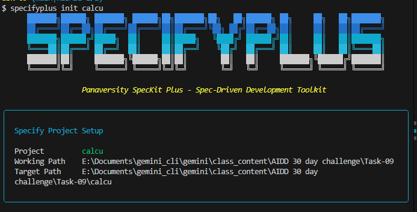

## AI Assistant Selection

After initialization, you will be asked to select your AI assistant. Choose the assistant you wish to use for the project.
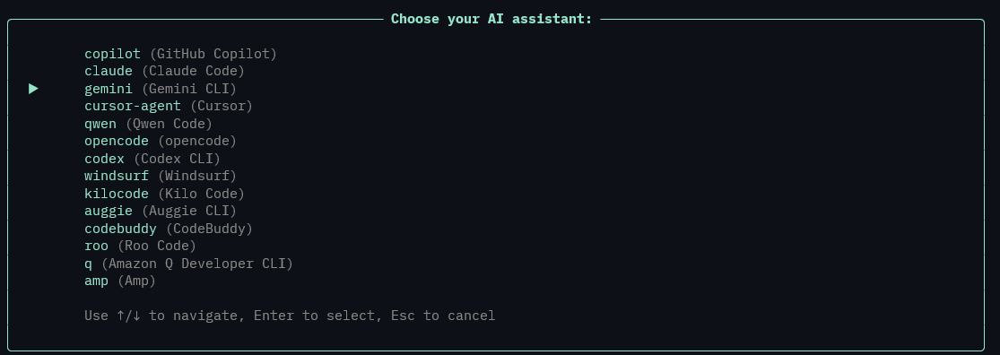

## Script Type Selection

Select your preferred script type. If you use Bash, select Bash; otherwise, choose PowerShell (ps).
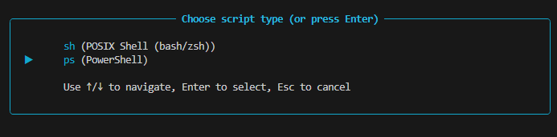

## Ready State

Once the setup is complete, you will see a screen similar to this, indicating that the agent is ready:
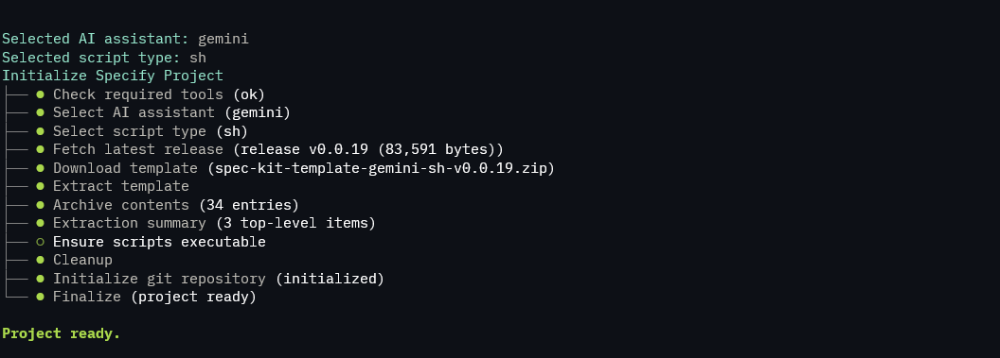

You will also see the main SpecifyPlus commands, which are essential for project development.
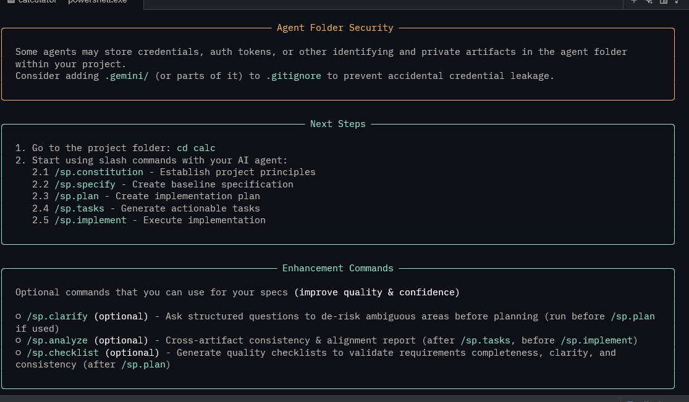

## Starting the CLI Agent

To start your CLI agent, type the command for your chosen agent. For example, if you are using Gemini:
```bash
gemini
```
Upon starting, you will see a folder structure similar to this:


To verify that the CLI agent has started successfully, type `/sp`. If you see a list of `sp.` commands, your project has been initialized correctly.

## Project Development Workflow

Here are the main commands to use for project development with SpecifyPlus:

### 1. Define Constitution

Use `/sp.constitution` to define the rules and regulations that your agent will strictly follow.
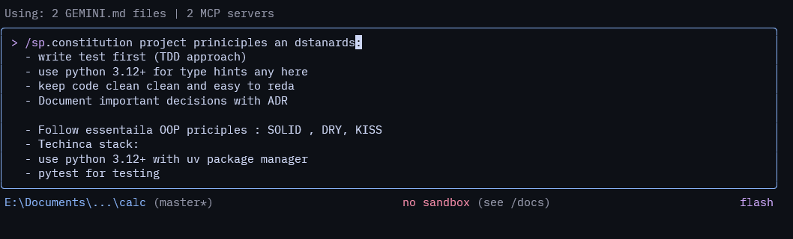

### 2. Specify Project Requirements

Use `/sp.specify` to write down the specifications for your project.
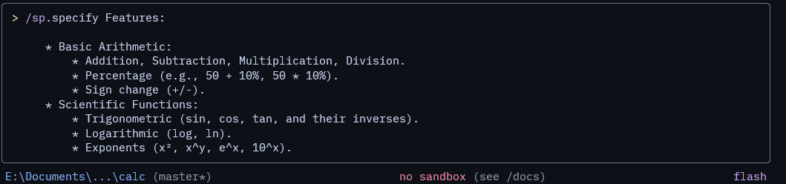

### 3. Generate Project Plan

After defining specifications, use `/sp.plan` to generate a detailed plan based on them. This will create a `plan.md` file.
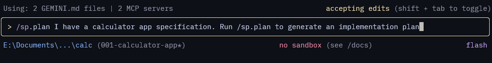
The agent will create a `plan.md` file for you.
like this:
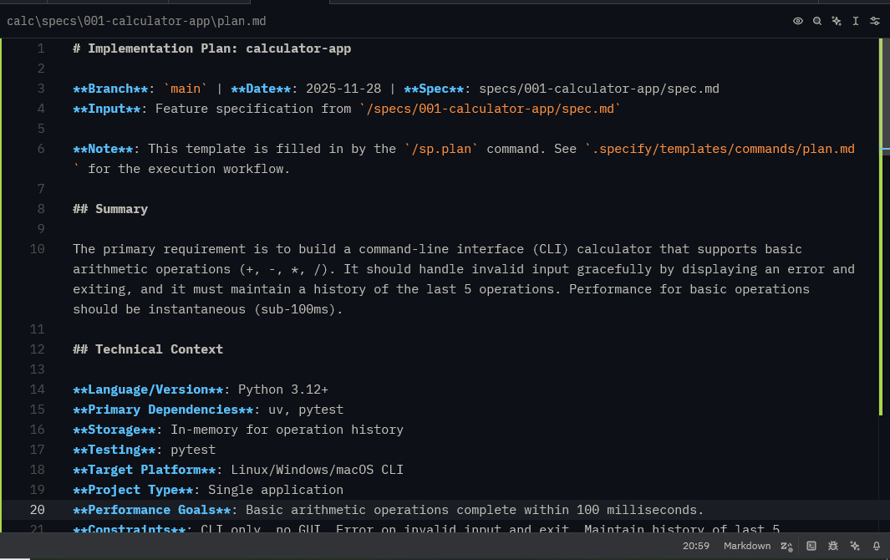

### 4. Create Tasks

Use `/sp.tasks` to create a `tasks.md` file, which will contain a list of tasks derived from your `plan.md`. The agent will break down tasks into phases and ask for your review after each phase is completed, like so:
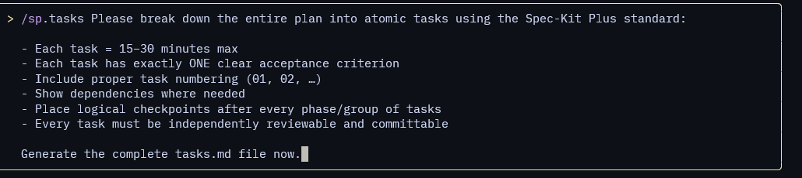
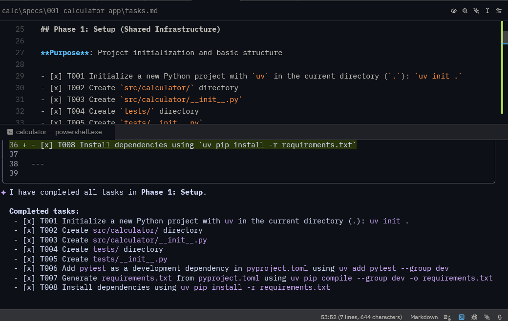

### 5. Implement Features

Finally, run `/sp.implement` to instruct the agent to begin implementing the features based on the defined tasks.
