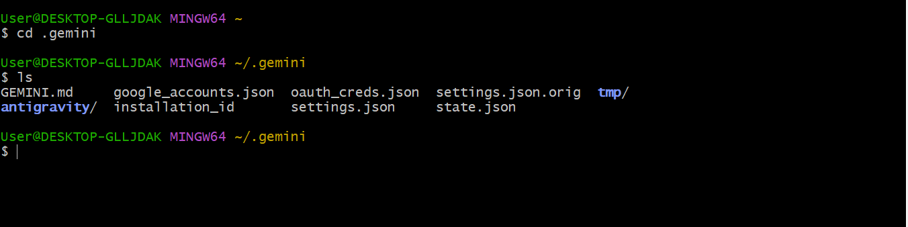
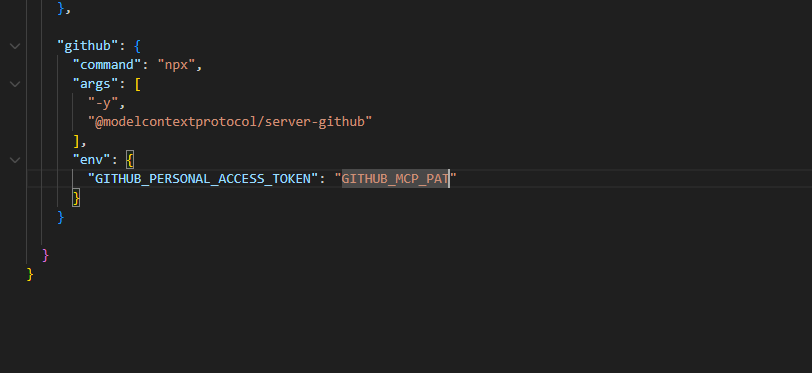

# Gemini-CLI MCP Server Connection Guide

This guide explains how to connect to MCP servers using **Gemini-CLI**. Follow these steps carefully depending on your operating system (Linux or Windows).

---

## Features

- 🔌 Connect multiple MCP servers simultaneously
- 🌐 Cross-platform support (Linux & Windows)
- ⚙️ Simple JSON configuration
- 🚀 Quick setup with npx

---

## Installation

Run the following command to install Gemini-CLI globally:
```bash
npm install -g @google/gemini-cli
```

---

## Setup Guide

### Step 1: Access the .gemini Folder

After installation, a `.gemini` folder will be created in your home/root directory.

**Navigate to it:**

**Linux:**
```bash
cd ~/.gemini
```

**Windows:**
```cmd
cd %USERPROFILE%\.gemini
```

**Check the files inside:**

**Linux:**
```bash
ls
```

**Windows:**
```cmd
dir
```

You should see several files including `settings.json`.



---

### Step 2: Configure settings.json

Open `settings.json` to configure MCP servers:

**Linux:**
```bash
cat settings.json
```

**Windows:**
```cmd
type settings.json
```

---

### Step 3: Add MCP Server Configuration

Inside `settings.json`, locate the `mcpServers` section. You can define multiple MCP servers. Here's an example:


```json
"mcpServers": {
  "context7": {
    "command": "npx",
    "args": ["-y", "@upstash/context7-mcp"],
    "env": {
      "CONTEXT7_API_KEY": "YOUR_CONTEXT7_API_KEY"
    }
  },
  "github": {
    "httpUrl": "https://api.githubcopilot.com/mcp/",
    "headers": {
      "Authorization": "YOUR_GITHUB_PAT"
    },
    "timeout": 5001,
    "command": "npx",
    "args": ["-y", "@modelcontextprotocol/server-github"],
    "env": {
      "GITHUB_PERSONAL_ACCESS_TOKEN": "YOUR_GITHUB_PAT"
    }
  }
}
```

**Notes:**
- Replace `YOUR_CONTEXT7_API_KEY` and `YOUR_GITHUB_PAT` with your actual credentials.
- **context7** → Example MCP server using Context7 protocol
- **github** → Example MCP server using GitHub Copilot API

---

## How to Run

Once configured, start Gemini-CLI:
```bash
gemini
```

Your MCP servers will be automatically connected and ready to use.

the run the command /mcp list


---

## Troubleshooting

**Cannot find settings.json?**
- Make sure you've run Gemini-CLI at least once after installation
- Check you're in the correct directory (`.gemini` in your home folder)

**Connection errors?**
- Verify your API keys are correct
- Check your internet connection
- Ensure the MCP server packages are accessible via `npx`

**Timeout issues?**
- Adjust the `timeout` value in your server configuration (default: 5001ms)

---

## Screenshots

*(Add screenshots here for visual reference)*

---

## Security

⚠️ **Important:** Never commit `settings.json` with real API keys to version control. Keep your credentials secure.

---

Made with ❤️ for developers • Gemini-CLI 2025